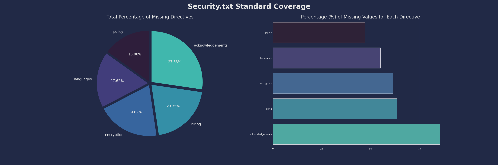
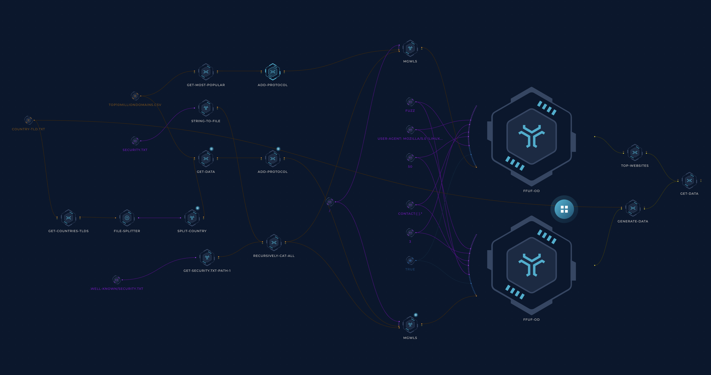

<h1 align="center">Safe Harbour</h1>
<h3 align="center"><a href="https://securitytxt.org">security.txt</a> collection of most popular world-wide domains</h3>

> "When security risks in web services are discovered by independent security researchers who understand the severity of the risk, they often lack the channels to disclose them properly. As a result, security issues may be left unreported. security.txt defines a standard to help organizations define the process for security researchers to disclose security vulnerabilities securely.” - [securitytxt.org](https://securitytxt.org/)

Our aim with this project is to:

- Help the community with the information where to submit vulnerabilities for the most popular websites
- Bring more attention to security.txt policies and their significance
- Have comprehensive research of the top 10000 websites and per country on the current security.txt posture and its improvements over time

## Statistics (Top 10000) - [top.csv](top.csv)

---

## How it works

### TB; DZ (Too big; didn't zoom)

- Get the list of countries and their tlds from [country-tld.txt](country-tld.txt) file.
- For each country (by using `file-splitter`)
    - Get hosts for their tld
    - Add http at the beginning of the line `sed 's/^/http:\/\//'`
    - Use [mglwls](https://github.com/trickest/mgwls) to create a new potential URLs (i.e. http://host.com/security.txt or http://host.com/.well-known/security.txt)
    - Use [ffuf](https://github.com/ffuf/ffuf) with `-mr` parameter to match `Contact: ` or `Policy: ` and follow redirects to verify [security.txt](https://securitytxt.org/) file
    - Execute `bash` script to generate the csv files per country
    - Execute `python` to generate a graph with statistics for each of the countries
---

> **Note**: As described, almost everything in this repository is generated automatically. We carefully designed the workflows (and continue to develop them) to ensure the results are as accurate as possible.

## Contribution

All contributions/ideas/suggestions are welcome! If you want to add/edit a target/workflow, feel free to create a new ticket via [GitHub issues](https://github.com/trickest/inventory/issues), tweet at us [@trick3st](https://twitter.com/trick3st), or join the conversation on [Discord](https://discord.gg/7HZmFYTGcQ).

## Build your own workflows!

We believe in the value of tinkering. [Get Access](https://trickest-access.paperform.co/) to the Trickest platform to customize this workflow to your use case, get access to many more workflows, or build your own from scratch!

